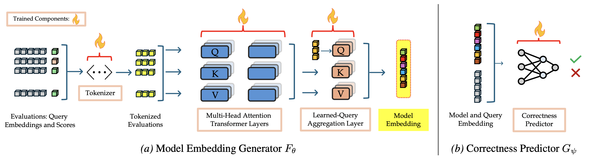

# LOCUS: Low-Dimensional Model Embeddings for Efficient Model Exploration, Comparison, and Selection

This repository is the **code release** for **LOCUS**, an attention-based method for producing low-dimensional **model capability representations** from query–model evaluation signals.

## Paper [arXiv](https://arxiv.org/abs/2601.21082)   

**Title:** *LOCUS: Low-Dimensional Model Embeddings for Efficient Model Exploration, Comparison, and Selection*. 

**Abstract** 
The rapidly growing ecosystem of Large Language Models (LLMs) makes it increasingly challenging to manage and utilize the vast and dynamic model pool effectively. We propose LOCUS, a method that produces low-dimensional vector embeddings that compactly represent a model’s capability across queries. LOCUS is an attention-based method that generates embeddings by a deterministic forward pass of an encoder model, enabling seamless incorporation of new models to the pool and refinement of existing model embeddings without having to perform any retraining. We additionally train a correctness predictor that utilizes model embeddings and query encodings to achieve state-of-the-art routing accuracy on unseen queries. Experiments show that LOCUS needs up to 4.8× fewer query evaluation samples than baselines to produce informative and robust embeddings. Moreover, the learned embedding space is geometrically meaningful: distances reflect model similarity, enabling a range of downstream applications including model comparison and clustering, model portfolio selection, and resilient proxies of unavailable models.


<p align="center">
  
</p>   


---

## Getting started

### 1) Create the environment

If you provide a portable conda environment file (recommended), from the repo root:

```bash
conda env create -f env_locus.yml
conda activate env_locus
````

If you prefer pip/venv, install the requirements listed in `env_locus.yml` (or a `requirements.txt` if you also include one).

### 2) Expected data layout

The training/evaluation code expects the **concise EmbedLLM parquet splits**:

```
data/datasets/embedllm/concise/
  model_order.csv
  concise.train.parquet
  concise.val.parquet
  concise.test.parquet
```

Each parquet has one row per prompt, with:

* metadata columns such as `prompt_id`, `prompt`, `category` (or similar)
* one or more embedding columns (configured by `EMB_COL`)
* label columns `label_<model_id>` for models listed in `model_order.csv`

### 3) Training

From the repository root:

```bash
python scripts/training_script.py --help
python scripts/training_script.py
```

By default, training writes checkpoints and logs under:

```
locus_encoder_decoder/models_<ANCHORS_PER_MODEL>/
```

---

## Repository structure (high level)

* `scripts/`
  Training and evaluation code for the LOCUS encoder–decoder approach (including correctness prediction + routing metrics).
  Key entrypoint: `scripts/training_script.py`.

* `data/`
  Data preparation utilities (e.g., generating/validating the concise parquet splits).

* `locus_encoder_decoder/`
  Default output location for trained checkpoints and training logs produced by `training_script.py`.

---

## What the code produces

A typical training run (see `scripts/training_script.py`) writes:

* encoder/decoder checkpoints (e.g., `encoder.pt`, `decoder.pt`)
* metadata (`meta.json` / `meta.pt`)
* per-epoch CSV logs (validation/test summaries)
* a compact `training_summary.json` capturing the best checkpoint and metric summaries

---

## Notes

* Paths and hyperparameters are intended to be **repo-relative** and configurable via the training script flags.
* If you change `EMB_COL` in `scripts/config.py`, ensure the chosen embedding column exists in the concise parquets.

